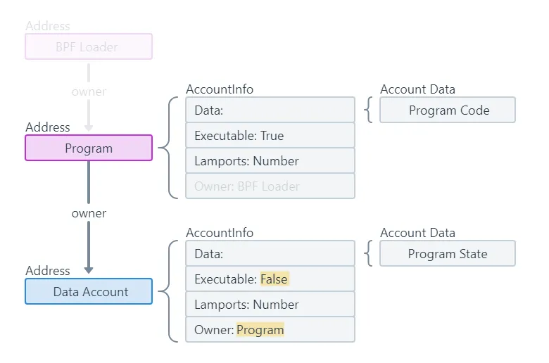
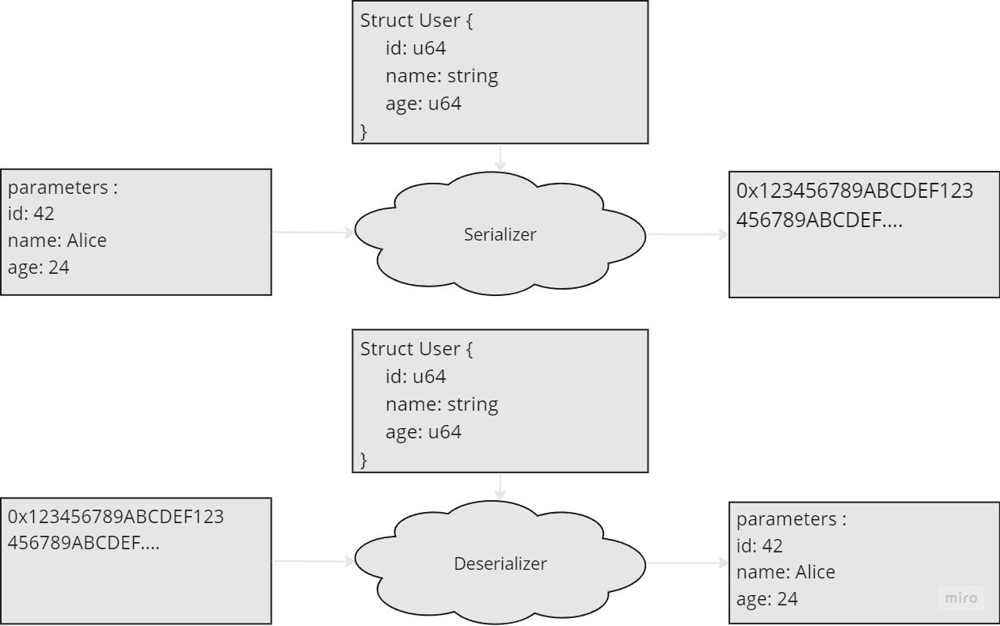
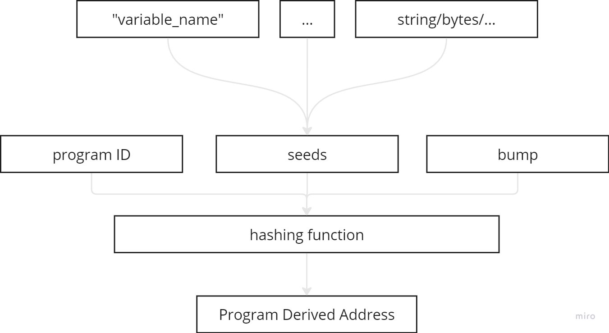
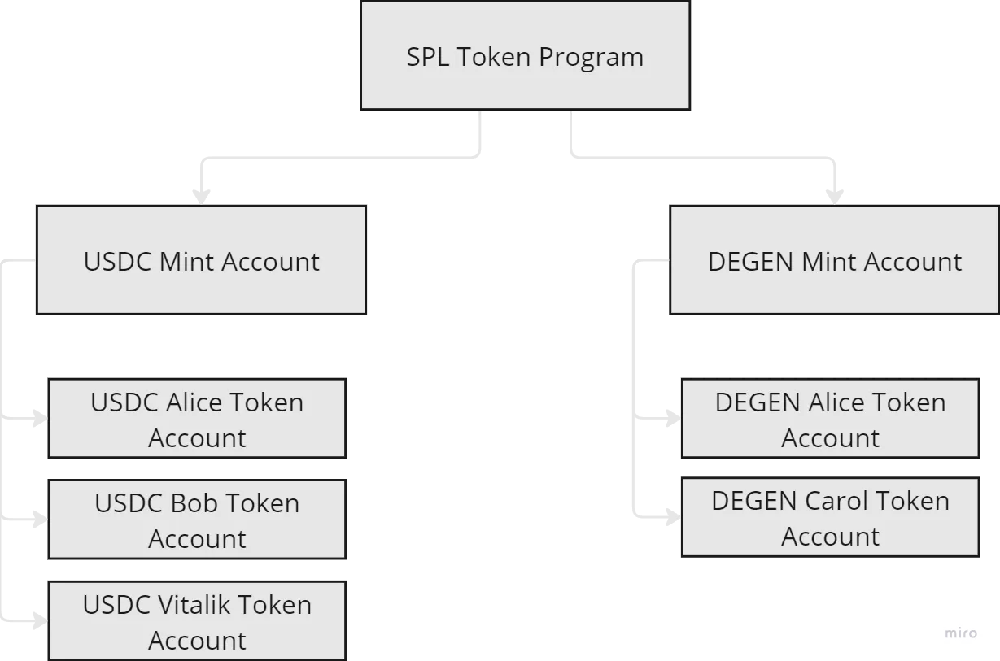
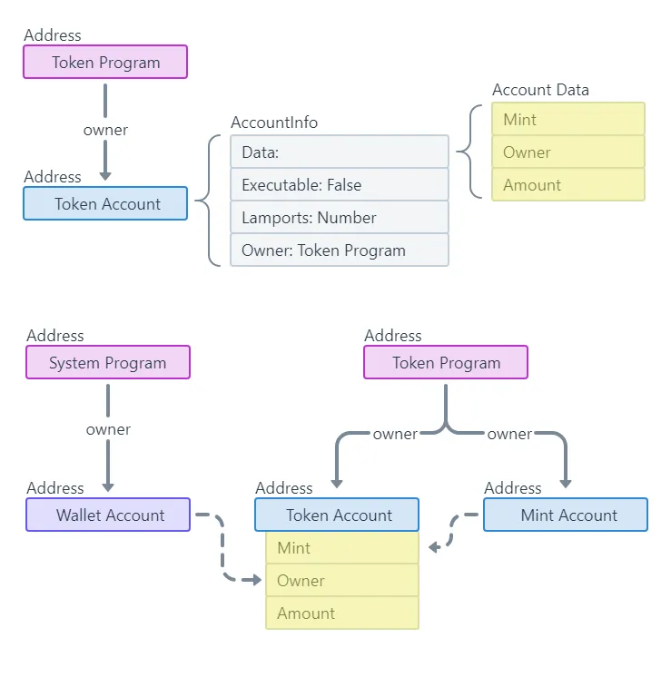

[🔗 link to the blog post](https://another-infected-blog.vercel.app/blog/solana-quick-start#4-programs-and-instructions)


1. [Solana](#1-solana)
2. [Account Model](#2-account-model)
3. [Reading and writing data](#3-reading-and-writing-data-from-data-accounts)
4. [Program and Instructions](#4-programs-and-instructions)
5. [CPI](#5-cross-program-invocation-cpi)
6. [Tokens](#6-tokens)
7. [Solana project architecture](#7-solana-project-architecture)
8. [Anchor](#8-anchor)
9. [Learning resources](#9-learning-resources)

# Introduction

### A bit of story

Like most web3 security researchers who started with no professional software development background, my journey began with **Ethereum**, the **EVM**, and **Solidity**.
Sixteen months have passed since I entered the endless [*Dark Forest*](https://www.paradigm.xyz/2020/08/ethereum-is-a-dark-forest).

I recently decided to take a look at **Solana** to broaden my expertise in programmable blockchains. Not because the EVM is boring (I see you coming). 
But as the Solana ecosystem is getting more traction recently, I thought it would be a great idea to be able to meet this new incoming demand.  

As I had no prior knowledge of **Rust** and **Solana**, I invested ~7 days to learn the basics.
My learning experience was eased thanks to many great resources, but mostly thanks to this really great course from Rareskills: [60 Days of Solana](https://www.rareskills.io/solana-tutorial).

I also tried to find a guide that would help me to quickly grasp the minimum requirements to dive into a codebase, but there wasn't one – this is the reason I'm writing this guide.

### What you'll learn

My goal here is to help you to easily navigate through a Solana project. This shouldn't require you to have prior knowledge of Solana, as I'll try to explain the necessary and important concepts required to follow through the article.  

While this will help you to quickly start with the Solana part, you will still need to learn a little bit of **Rust** to *really* feel comfortable with a codebase, as some programming concepts are very specific to this language. 
However, don't feel pressured to master Rust separately – you can learn it while auditing. The Solana ecosystem uses only a fraction of Rust's capabilities, and with an LLM to help you understand specific code sections, the learning experience should be quite manageable.  

# 1. Solana
**Solana** is a high throughput blockchain, the third most important in terms of TVL (after Bitcoin and Ethereum), and the second most important programmable blockchain after Ethereum.  

A **programmable blockchain** can be seen as a *distributed world computer*, storing data, and executing commands for anyone who is willing to pay for it.  

Solana is very interesting as it has taken a very different path than Ethereum, by creating its own layers from the ground up. Its architecture prioritizes scalability and speed through specific mechanism.

But what really interest us here is the execution layer of Solana, also called the **Solana Virtual Machine** (**SVM**). This layer is responsible for receiving transactions and executing them based on the state of the blockchain.  

On a computer, data is stored inside files – on Solana, data is stored inside **accounts**. That data can be informational data, or executable data, but ultimately, this is nothing more than zeros and ones stored inside "accounts".  

Accounts are in my opinion similar to files (with specific properties), as they exist in different types (file extensions), some of them having a "native extension" (data account, executable accounts), and then they can contain anything, from a DEX program to users datas (e.g a "data account" to store user balances for a token).  
Also, like files on an OS, accounts have access control mechanisms ensuring only only authorized addresses can execute operations on it.

# 2. Account Model

The **Account Model** is probably what took me the most time to get my head around, probably because the relation between the model and how it reflects in the code is not that obvious.  
But in reality, this is pretty simple to understand.

A great analogy from the [Rareskills course](https://www.rareskills.io/solana-tutorial) I mentioned earlier compares Solana to the well-known Linux principle: *'Everything is a file.'*  

For Solana, we might say, *'Everything is an account.'*  

Accounts are in fact a dedicated "space" on the blockchain (up to 10MB), which can contain different kinds of information, and can be accessed through an address representing its "location" in the blockchain. 

While on the **EVM** an account can hold both logic and mutable data at the same time, in **Solana**, accounts can either hold data, or executable logic, but not both at the same time.  

If Solana accounts cannot hold both data and logic, this means a program do not have direct access to data. How then can a program to be **dynamic** when it needs to read and write data in order to execute its logic?  

How does a program create and maintain information about its state and users? 

# 3. Reading and writing data from data accounts

A program (in the general sense) - usually - requires to maintain state variables to store essential information necessary for its operation. Consider a vending machine program as an example – it needs to store various information like: the remaining quantity for each product, their price, their position on the grid, the technician's access code, and so on. It is called variables because obviously, their value change over time, responding to various actions (receive money, deliver a product, etc).

Unlike most traditional systems, **executable account programs** in Solana cannot store data alongside their executable code. Instead, they must utilize an alternative storage solution. This is where **data accounts** come into play as the primary storage mechanism.

*Below an illustration from the Solana documentation: 2 accounts are represented: a program, and a data account. The program account owns the data account and use it to store information related to its program.*



For each new variable that a program needs, a new data account can be created. Once created, to access the variable (stored in the newly created account), the program only needs to remember its address to either write to and read from it.

As you might think, creating a new unique account for each required variable would be very inefficient. Instead, Solana allows developers to create structured storage solutions where multiple values can be stored within a single account.



To write to data accounts in a structured way, programs use a **serializer**, and to read it back a **deserializer** is necessary (this process is transparent when using the common Solana framework and libraries). 
But how are those data accounts created?

Accounts (and therefore data accounts) all have their own address on the blockchain, which we can use to access them. While this makes sense for a program to require the address of external data to be able it will need to read, on the contrary this would be pretty inefficient if a program had to store, or request as an input from the user the addresses to access its own state variables.

Hopefully, that is not the case, and what happens is that data accounts created from a program (by a program) have a special type of address called a **Program Derived Address** (or **PDA**). PDAs are generated in a deterministic way by [hashing](https://www.geeksforgeeks.org/what-is-hashing/) the program's own address and any optional number of seeds (bytes values), and a bump (you can search for this one later, but its not important right now).



Because the process is deterministic, programs now have a way to create new variables, and automatically retrieve these variables. Again, all this process is transparent thanks to the available Solana framework and libraries.

# 4. Programs and Instructions

**Solana programs** serve as the foundation for executing blockchain logic. While Solana provides several essential **native programs** (such as account deployment utilities), the ecosystem primarily consists of user-deployed programs that extend the blockchain's functionality.

Unlike **EVM** smart contracts, **Solana programs** are stateless and cannot store mutable data (they can have constants, as this is embedded inside the bytecode of the program). 

Instead, programs must receive data account addresses as parameters when called, allowing them to access and manipulate data externally.

To access a program and execute its logic we need to call what is called a program's **instruction**.

An **instruction** requires three fundamental components:

1. **Program ID**: The address of the program you want to execute
2. **Accounts**: A list of all accounts the instruction needs to interact with (read/write or call through an external call, also known as CPI)
3. **Instruction Data**: Supplementary parameters that don't require dedicated accounts (amount to transfer, new value to set, etc.)

To demonstrate these concepts, let's examine a simplified example (*be aware that I've removed many important things from the code for clarity – we'll explore the complete implementation with all necessary components in Part 7*):

```rust
pub fn deposit(ctx: Context<Deposit>, amount: u64) -> Result<()> {
    // Transfer `amount` of tokens from user_token_account to vault...
}

// the context needed by the instruction
pub struct Deposit<'info> {
    // The user's wallet, which must sign the transaction
    pub user: Signer<'info>,

    // The user's token account that we'll withdraw from
    pub user_token_account: Account<'info, TokenAccount>,

    // The vault where we will deposit the tokens
    pub vault: Account<'info, TokenAccount>,

    // The program that we will use to transfer tokens
    pub token_program: Program<'info, Token>,
}
```

Above a `deposit` instruction that take as input multiple accounts that are described by the `Deposit` struct:

- the first account, `user` is the caller account (the `Signer` type is special as it automatically store the caller informations)
- `user_token_account` and `vault`, two data accounts where the tokens will be taken from/deposited. As we said in part 2, data is usually organized in structs, which is for those two accounts `TokenAccount`
- `token_program`, a program account that we will call to execute the transfer

# 5. Cross Program Invocation (CPI)

A **Cross Program Invocation** consists of executing an instruction from another program. To do so, it is required to provide (1) the address of the program (2) the data needed by the program's instruction; we call this the **CPI context**.

Here's an example I've borrowed from [this lesson](https://www.rareskills.io/post/cross-program-invocation):

```rust
pub fn send_sol(ctx: Context<SendSol>, amount: u64) -> Result<()> {  
    let cpi_context = CpiContext::new(                   // building the CPI Context:
        ctx.accounts.system_program.to_account_info(),   //(1) address of the program
        system_program::Transfer {                       //(2) data required by the program
            from: ctx.accounts.signer.to_account_info(), //(2)
            to: ctx.accounts.recipient.to_account_info(),//(2)
        }
    );
    
    // calling the program with the context (and an additional parameter `amount`)
    let result = system_program::transfer(cpi_context, amount); 

    if result.is_ok() {
        return Ok(());
    } else {
        return err!(Errors::TransferFailed);
    }
}
```

This instruction sends **SOL** (Solana's native cryptocurrency/token) from the signer to a recipient.

The first we need to do is create the context in which the instruction will be executed:

1. the address of the program, which here is represented by `system_program.to_account_info`
2. the data required by the instruction which is bundled in the struct `Transfer`containing two informations: `from` (the address sending the SOL) and `to` (the address receiving the SOL).

Then, the CPI is executed with the context (and an additional parameter `amount`)

In this example, the called program is a **Solana system program**, but if we were to call another user-deployed program, this would look like this:  
`external_program::cpi::instruction_name(cpi_ctx, additional_param1, ...)`

# 6. Tokens

Solana's token ecosystem is very different from what we know in the EVM. 

While in the EVM every token has its own contract (i.e program in Solana), in Solana, there is one program called the **SPL Token program** from which can be derived **Mint Accounts**.

Each instance of a token will have its unique **Mint account**: e.g USDC Mint Account, USDT Mint Account, …and so on. 

Then, from these Mint Accounts, users can create **Token Accounts** – specialized accounts which required to hold that specific token.

Consider a user like Alice who holds multiple tokens (USDC, USDT, and DEGEN). She needs a separate Token Account for each asset, all derived from their respective Mint Accounts. This structure applies uniformly across all users in the Solana ecosystem.

Below an illustration showing how token program are organized:



In this architecture, the only program account is the **SPL Token Program**. The other accounts are data accounts that can be modified by the SPL Token Program.

The **SPL Token Program** is the owner of those accounts in the sense that only this program has the right to modify those accounts. This means that to update them, we need to perform a **CPI** to the SPL Token Program, and provide the accounts we want to see updated (as explained in [section 4](#4-programs-and-instructions) above).

Obviously, the SPL Token Program implements access control logic to prevent users to transfer tokens from an account they do not own.

If you remember what we said about **PDAs** (Program Derived Accounts), only programs that deployed those accounts can modify their state.

But these data accounts (Mint Accounts and Token Accounts) have many fields, and one of them is called `owner`, different from the *program owner* we just talked in the second paragraph, which not part of the data, but a "Solana metadata" executing at a higher level.

This `owner` field inside those accounts is checked by the SPL Token Program and compared with the caller signature (like tx.origin in EVM) to ensure only legitimate access.

See this well thought diagram from the [Solana documentation](https://solana.com/docs/core/tokens#token-account):




# 7. Solana project architecture

If you're new to Solana project architecture or Rust projects in general, the structure might seem a bit overwhelming at first. Let's break down this simple project (before moving on to a more complex one) by examining each file's purpose:

```bash
# 1. Basic Project (No instructions folder)
my-solana-project/
├── Anchor.toml                    # Anchor configuration file
├── Cargo.toml                     # Rust configuration file
├── programs/                      # Folder for all programs
│   └── my-program/                # Each program will have its own folder
│       └── src/
│           ├── instructions/      # folder containing each instructions called by lib.rs
│           │   ├── mod.rs         # imported by lib.rs to import all instructions
│           │   ├── initialize.rs  # each instruction
│           │   ├── deposit.rs
│           │   └── withdraw.rs
│           ├── lib.rs             # Main program file
│           ├── state.rs           # Program state structs
│           └── errors.rs          # Custom errors
└── tests/
    └── my-program.ts
```

Project-specific files:

- `Anchor.toml`: This is simply the configuration file for **Anchor** to work, see what can be setup [here](https://www.anchor-lang.com/docs/manifest)
- `Cargo.toml`: Workspace configuration for **Rust**, something very important is buried inside: *by default Rust do not check for overflows, but this can be configured in this file setting the key `overflow-checks = true` under the section `[profile.release]`*
example of a Cargo.toml file [here](https://github.com/solana-developers/program-examples/blob/main/tokens/transfer-tokens/anchor/Cargo.toml)

Program-specific files:

- `programs/` : This folder is where all the programs will be stored
- `my-program/`: Here this should the program name, depending on the project there can be multiple program folders inside the `programs` parent folder
- `instructions/`: Contains the logic for all instructions that can be called from `lib.rs`
- `lib.rs`: The program's entry point containing publicly accessible functions (subject to any implemented authorization logic). *It typically acts as a wrapper, routing calls to the appropriate instruction handlers in the `instructions` folder*
- `state.rs`: This is where *usually* are located the different data structures that will be used by your instructions
- `error.rs`: A centralized file for custom error code definitions
- `tests/`:  The testing directory. *While you can write tests in both TypeScript and Rust, TypeScript is preferred due to its more comprehensive testing library support*


Let’s see now another project (I will only discuss about the differences):

```bash
my-solana-project/
├── Anchor.toml
├── Cargo.toml
├── package.json
├── programs/
│   ├── my-program/           # First program
│   │   ├── Cargo.toml
│   │   └── src/
│   │       ├── lib.rs        # each program has its own entrypoint file
│   │       ├── instructions/
│   │       │   ├── mod.rs
│   │       │   ├── deposit.rs
│   │       │   └── withdraw.rs
│   │       ├── state.rs
│   │       └── errors.rs
│   └── my-other-program/     # Second program
│       ├── Cargo.toml
│       └── src/
│           ├── lib.rs          # each program has its own entrypoint file
│           ├── instructions/   # Instructions are organized in different folders 
│           │   ├── mod.rs
│           │   ├── utils.rs    # a non-instruction file containing utilitaries used by instructions
│           │   ├── user_management/    # User-related instructions
│           │   │   ├── mod.rs
│           │   │   ├── create_user.rs
│           │   │   └── update_user.rs
│           │   └── token_management/   # Token-related instructions
│           │       ├── mod.rs
│           │       ├── mint.rs
│           │       └── burn.rs
│           ├── state/       # we changed for a state folder with multiple state files
│           │   ├── mod.rs
│           │   ├── user.rs  # for each instruction group
│           │   └── token.rs # for each instruction group
│           └── errors.rs
└── tests/
```

The main differences here are:

- the project manages multiple programs at once: each program will be deployed separately and independently on the blockchain, each having their own public address.
- As `my-other-program/` implements a more complex logic, the developers have decided to group instructions in separate folders based on their common features.
    - A standalone `utils.rs` file outside the instruction groups contains shared utility functions (e.g., mathematical operations) used across multiple instructions
    - You see a `mod.rs` file at the root of `instructions/` and also inside each group instructions folder: this is to streamline instruction imports in `lib.rs`
    - The original single `state.rs` file has evolved into a dedicated `state/` directory, with separate state files mirroring the instruction group structure

This is basically how will look like most of the Solana project you will encounter.

# 8. Anchor

[Anchor](https://www.anchor-lang.com/) is a Rust (*and Typescript for tests*) framework developed by [Coral](https://github.com/coral-xyz/anchor) providing tools that helps developers to write secure programs faster. 

The framework contains numerous [macros](https://docs.rs/anchor-lang/latest/anchor_lang/index.html#macros) and [traits](https://docs.rs/anchor-lang/latest/anchor_lang/index.html#traits) (Rust concepts) that implement a lot of important components, such as an account data [serializer and deserializer](https://github.com/Ackee-Blockchain/Solana-Auditors-Bootcamp/blob/master/Lesson-1/README.md#attribute-macro-program) that we talked about in [section 2](#2-account-model), [automatic access control checks](https://github.com/Ackee-Blockchain/Solana-Auditors-Bootcamp/blob/master/Lesson-1/README.md#account) on accounts, or an [instruction dispatcher](https://github.com/Ackee-Blockchain/Solana-Auditors-Bootcamp/blob/master/Lesson-1/README.md#attribute-macro-program) routing instructions call to the appropriate logic section.

As you can see, all of these tools are really important and you might not want to re-develop these components from scratch. For that reason, most of the Solana programs you will encounter use Anchor, and you will need to know its basics.

## Main program (lib.rs)

Let’s start with the two first ones you will always encounter, `declare_id!()` and `#[program]`. 

They are located in [`lib.rs`](http://lib.rs) which can be considered the “main” of a program, as this is where all your program’s entry-points are located.

See this example code:

```rust
use anchor_lang::prelude::*;

declare_id!("ABC123xyz...");

#[program]
pub mod basic_program {
    use super::*;

    pub fn entrypoint_to_instruction_1(ctx: Context<InstructionOne>) -> Result<()> {
        instructions::instruction_1::handler(ctx)
    }

    pub fn entrypoint_to_instruction_2(ctx: Context<InstructionTwo>) -> Result<()> {
        instructions::instruction_2::handler(ctx)
    }
}
```

`declare_id!()` is a [function-like macro](https://www.rareskills.io/post/rust-function-like-macro) (basically a powerful tool that inject new code before compilation) used to define a program’s on-chain address. You don’t need to no more about it, as this is automatically populated when creating a program with Anchor CLI.

[`#[program]`](https://github.com/Ackee-Blockchain/Solana-Auditors-Bootcamp/blob/master/Lesson-1/README.md#attribute-macro-program) is an [attribute-like macro](https://www.rareskills.io/post/rust-attribute-derive-macro) (similar to the other macro, but applying over structs) that creates a low-level dispatcher that takes transactions/CPI and redirect them to the correct location in the program code to execute the requested function. 

The dispatcher ensures authorizations, validation of inputs, and many other [security checks](https://github.com/Ackee-Blockchain/Solana-Auditors-Bootcamp/blob/master/Lesson-1/README.md#attribute-macro-program) with the help of some other macros we will see further right now in the next chapter.

## A deposit instruction

Do you remember the deposit instruction we’ve seen in part 4? 

Here’s a more complete implementation:

```rust
pub fn deposit(ctx: Context<Deposit>, amount: u64) -> Result<()> {
    // Transfer `amount` of tokens from user_token_account to vault...
}

#[derive(Accounts)]
pub struct Deposit<'info> {
    // The user's wallet, which must sign the transaction
    #[account(mut)]
    pub user: Signer<'info>,

    // The user's token account that we'll withdraw from
    #[account(
        mut,
        constraint = user_token_account.owner == user.key()
    )]
    pub user_token_account: Account<'info, TokenAccount>,

    // The program's vault where we'll deposit the tokens
    #[account(
        mut,
        seeds = [b"vault"],
        bump
    )]
    pub vault: Account<'info, TokenAccount>,

    // The SPL Token program that we'll use to transfer tokens
    pub token_program: Program<'info, Token>,
}
```

First thing to observe is what the instruction takes as input:

- `Context<Deposit>` a wrapper containing all the accounts needed for the instruction
- `amount: u64` the quantity of tokens to deposit

The `Deposit` struct is described below the instruction, and we can see a fair number of macros involved:

- The first one is `#[derive(Accounts)]` macro in Anchor is used to define and validate the accounts that an instruction will interact with during execution, enabling Solana’s parallel transaction processing. The macro also implements validation checks for the accounts based on their [type](https://www.anchor-lang.com/docs/account-types) (Account, Signer, UncheckedAccount, Program)
- The second one is the `#[account()]` macro: as you can see, different parameters can be provided to that macro. Those parameters are called [account constraints](https://github.com/Ackee-Blockchain/Solana-Auditors-Bootcamp/blob/master/Lesson-1/README.md#account-constraints), as they will add additional checks that will be verified every time the program will access those accounts.

Let’s go over some of the constraints:

- For example, the `user` account has the `mut` constraint, which indicate to the program that this account is mutable. Without this constraint, the program would revert if at any time the account is modified.
- We can see below the following one: `constraint = user_token_account.owner == user.key()`.This constraint ensure that the `user_token_account` owner field, and the `user` public address have the same value. This is in fact an access control, ensuring only the signer of the transaction is authorized to call the instruction with this specific `user_token_account`.
- The next one we see is `seeds = [b"vault"]`: this is specific to PDA (Program Derived Accounts). This add checks to ensure that the provided `vault` account has been created by the program we’re calling right now, and that it has been derived with the following seed.
- `bump` is simply an additional parameters when deriving PDAs

You can find all Anchor constraints in [their documentation](https://www.anchor-lang.com/docs/account-constraints) or on [this course](https://github.com/Ackee-Blockchain/Solana-Auditors-Bootcamp/blob/master/Lesson-1/README.md#account-constraints) by Ackee Blockchain.

# 9. Learning resources

Thank you for taking the time to read through this guide!

I hope it has provided you with a solid foundation to start exploring Solana projects. Remember, this is just the beginning, the best way to learn is by diving into actual codebases and connecting the concepts we've covered here with real implementations.

If you found this guide helpful, feel free to share it with others fellow researchers. I would also greatly appreciate any [feedback or suggestions](https://twitter.com/messages/compose?recipient_id=1436561550010093574) for improvement, as this helps make the resource better for everyone.

For those looking to dive deeper into Solana auditing, I’ve gathered some interesting resources:

- [Solana RareSkills articles](https://www.rareskills.io/category/solana)
- [60 Days of Solana (RareSkills)](https://www.rareskills.io/solana-tutorial)
- [Basic Rust for Solidity Developers](https://www.rareskills.io/post/rust-basic-syntax)
- [Understanding Solana for EVM developers](https://solana.com/developers/evm-to-svm)
- [Solana Developers courses](https://solana.com/developers/courses)
- [Ackee Solana Auditors Bootcamp (repo)](https://github.com/Ackee-Blockchain/Solana-Auditors-Bootcamp/tree/master)
- [Ackee Solana Auditors Bootcamp (videos)](https://www.youtube.com/playlist?list=PLzUrW5H8-hDdU-pzHjZrgupi5Wis6zWNJ)
- [Solana Auditing and Security Ressources (not actively maintained)](https://github.com/sannykim/solsec)
- [Anchor documentation](https://www.anchor-lang.com/)
- [A Hitchhiker's Guide to Solana Program Security](https://www.helius.dev/blog/a-hitchhikers-guide-to-solana-program-security)
- [Ottersec Sample Public Audit Reports (select “Solana” as chain)](https://www.notion.so/a296e98838aa4fdb8f3b192663400772?pvs=21)

Happy auditing!

